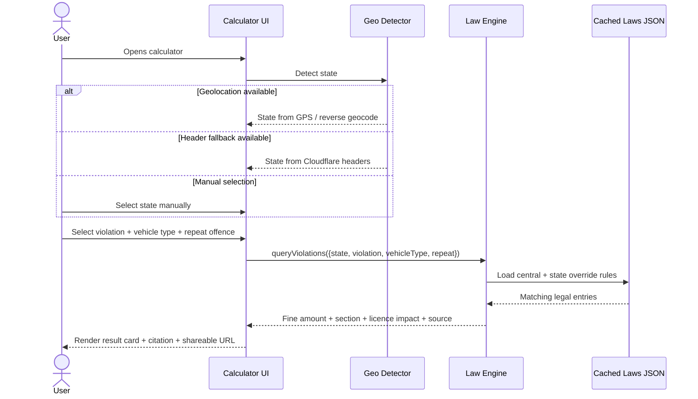
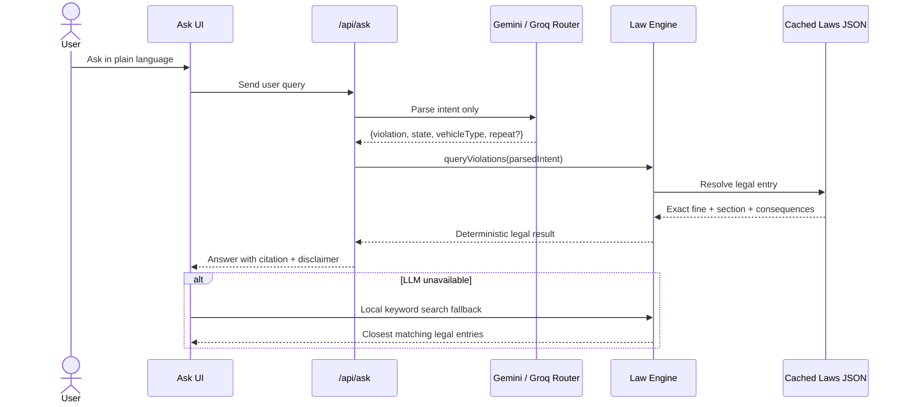
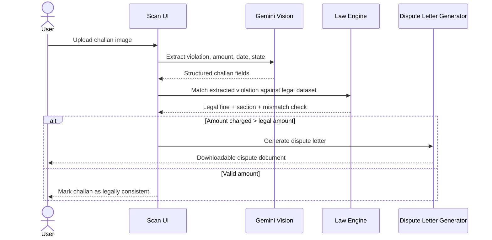
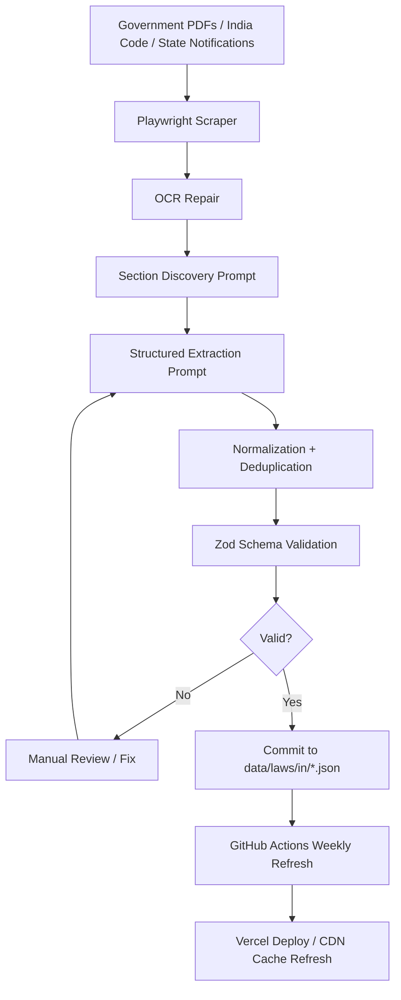
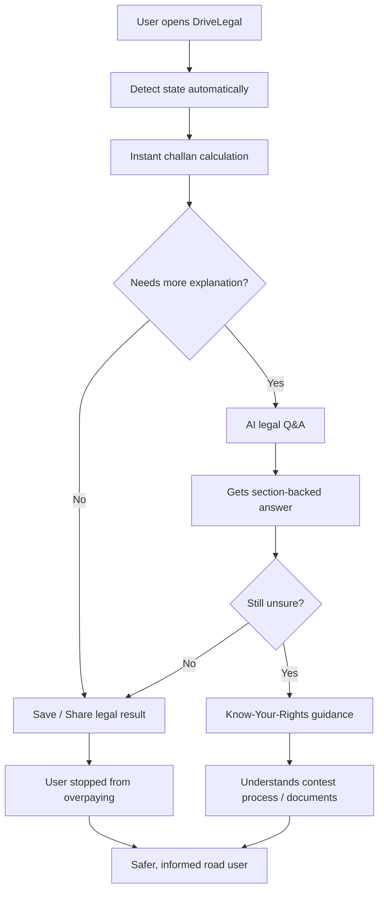
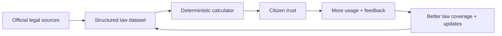

<!--
  DRIVELEGAL — HACKATHON SUBMISSION
  Offline-First PWA + LLM-Augmented Legal Engine
  Ask. Know. Contest. Drive Safe.
  Deployed: Vercel | Edge: Cloudflare | AI: Gemini 1.5 Flash + Groq (Llama-3.1) + HuggingFace
-->

<div align="center">


<br/>

<a href="https://drivelegal.vercel.app/">
  
</a>

<br/><br/>

[
[
[
[
[
[
[
[
[
[

<br/>

[🌐 Live Demo](https://drivelegal.vercel.app/) &nbsp;- &nbsp;
[📋 Problem Statement](#-problem-statement) &nbsp;- &nbsp;
[🗺️ Implementation Plan](#-40-day-master-timeline) &nbsp;- &nbsp;
[⚖️ Data Sources](#-data-acquisition--curation) &nbsp;- &nbsp;
[🐛 Report Bug](../../issues) &nbsp;- &nbsp;
[💡 Request Feature](../../issues)

</div>

***

## 📖 Table of Contents

- [What is DriveLegal?](#-what-is-drivelegal)
- [Problem Statement](#-problem-statement)
- [Core Features](#-core-features)
- [System Architecture](#-system-architecture)
- [Workflow Diagrams](#-workflow-diagrams)
- [Integrated Ecosystem](#-integrated-ecosystem)
- [Tech Stack](#-tech-stack-breakdown)
- [Data Acquisition & Curation](#-data-acquisition--curation)
- [Data Schema](#-data-schema)
- [LLM Extraction Pipeline](#-llm-extraction-pipeline)
- [Feature Specs](#-feature-specs)
- [UI / UX & Accessibility](#-ui--ux--accessibility)
- [Testing & Hardening](#-testing--hardening)
- [Scale Engineering](#-scale-engineering--how-we-serve-9m-users-on-free-tiers)
- [Quick Start](#-quick-start)
- [Environment Variables](#-environment-variables)
- [Project Structure](#-project-structure)
- [40-Day Master Timeline](#-40-day-master-timeline)
- [Risks & Mitigations](#-risks--mitigations)
- [Success Metrics](#-success-metrics)
- [Roadmap](#-roadmap)
- [Deployment](#-deployment)
- [Contributing](#-contributing)
- [Team](#-team)

***

## 🎯 What is DriveLegal?

> **DriveLegal** is an **offline-first Progressive Web App** that acts as an **AI legal companion for every road user**. It fuses a **deterministic challan calculator**, **LLM-powered natural-language Q&A**, a **scan-and-verify overcharge detector**, and a **multilingual Know-Your-Rights chatbot** — all served over a **zero-backend, static-first architecture** that runs on free tiers and scales to millions.

Think of it as: **Google Translate** × **TurboTax** × **Wikipedia-for-traffic-law** — built for hackathon, engineered to scale, and designed to work **even in airplane mode**.

```
┌──────────────────────────────────────────────────────────────────┐
│                 DRIVELEGAL VALUE PROPOSITION                     │
├───────────────────────┬──────────────────────┬───────────────────┤
│    Traditional        │     DriveLegal       │      Outcome      │
├───────────────────────┼──────────────────────┼───────────────────┤
│ Citizens don't know   │ Instant fine lookup  │ Transparency &    │
│ the actual fine       │ by state + section   │ informed citizens │
├───────────────────────┼──────────────────────┼───────────────────┤
│ Lawyers charge ₹1000+ │ Free AI legal Q&A    │ Access to justice │
│ for basic questions   │ with citations       │ for every driver  │
├───────────────────────┼──────────────────────┼───────────────────┤
│ Overcharging at       │ Scan-and-Verify OCR  │ Empowered         │
│ checkpoints           │ + dispute letter     │ disputing         │
├───────────────────────┼──────────────────────┼───────────────────┤
│ English-only legal    │ 10+ Indic languages  │ True inclusivity  │
│ information           │ + voice queries      │                   │
├───────────────────────┼──────────────────────┼───────────────────┤
│ Needs 4G + server     │ Works 100% offline   │ Reliable on hwys  │
│ every single time     │ after first visit    │ & rural roads     │
└───────────────────────┴──────────────────────┴───────────────────┘
```

***

## 🧩 Problem Statement

> 60% of Indian drivers do **not** know the fines they pay at checkpoints — and a material percentage of those fines are **incorrect, outdated, or deliberately inflated**. There is **no single authoritative, multilingual, offline-capable tool** that tells a citizen exactly what the law says for their state, their vehicle, and their situation.

**DriveLegal solves three compounding failures simultaneously:**

1. **Information asymmetry** — The full Motor Vehicles Act, 36 state amendments, and hundreds of notifications are scattered across government PDFs.
2. **Language barrier** — Over 70% of Indians are not comfortable reading legal English.
3. **Connectivity barrier** — Highways, rural areas, and checkpoint scenarios often have poor or no data coverage.

***

## ✨ Core Features

### 🧮 Challan Calculator
- 3-step wizard: **Violation × Vehicle × State × Repeat offender?**
- Instant results — **zero spinner**, because all data is local JSON
- Returns: exact fine, legal section, imprisonment risk, licence impact, shareable URL
- Supports all **36 states & UTs** with state-specific overrides

### 💬 Natural-Language Q&A
- Ask in plain English or Hindi: *"How much fine if I don't wear helmet in Pune?"*
- **LLM only parses intent** → structured query → lookup in local authoritative JSON
- **LLM never invents fines** — all answers cite the exact source section + page
- Fallback: keyword search on local data if LLM is unreachable

### 📸 Scan-and-Verify OCR  ⭐ Hero Feature
- User uploads photo of a challan receipt
- **Gemini 1.5 Flash Vision (free tier)** extracts violation, date, amount charged
- Engine **compares charged amount vs legal amount** → flags overcharging in red
- **Auto-generates a Dispute Letter PDF** with correct section references if overcharged

### 📡 Offline-First PWA
- Service worker precaches app shell + `violations.json` (2.5 MB, ~400 KB gzipped)
- **100% of core features work in airplane mode** after first visit
- Installable on Android/iOS home screen — looks and feels like a native app
- Background sync for Q&A history

### 🌐 Multi-Language Support
- **Pre-translated** UI + law titles/descriptions in **10+ languages**: English, Hindi, Tamil, Marathi, Telugu, Bengali, Gujarati, Kannada, Malayalam, Punjabi
- Dynamic Q&A responses translated on-the-fly
- **Voice queries** via Web Speech API in all supported Indic languages

### ⚖️ Know-Your-Rights Chat
- Pre-prompted Gemini chatbot with strict guardrails
- Topics: **contesting a challan, Lok Adalat procedure, traffic court flow, required documents**
- Disclaimer auto-injected in every response for legal safety

### 🌍 Global Mode
- Top 10 countries: **USA, UK, UAE, Australia, Canada, Germany, Singapore, Japan, Saudi Arabia, Nigeria**
- Country-specific rule packs bundled at build time (not runtime)
- One-click country switch from the header

### 🧩 Embeddable Widget
- `<iframe src="drivelegal.app/embed/calculator?state=TN">`
- Designed for driving schools, state government sites, insurance portals, fleet operators

***

## 🏗️ System Architecture

### The Core Insight

> DriveLegal is **static-first, LLM-assisted** — not LLM-first. **95%+** of all user queries are resolved by a **deterministic rule engine running in the browser** on cached JSON. The LLM is invoked only for **natural-language understanding** (parsing a sentence into `{violation, state, vehicle}`) — never for generating legal amounts.

```
┌─────────────────────────────────────────────────────────────────────┐
│                       USER BROWSER (PWA)                            │
│  ┌───────────────────────────────────────────────────────────────┐  │
│  │  Service Worker (offline cache)                               │  │
│  │    • violations.json (2.5 MB)                                 │  │
│  │    • UI shell                                                 │  │
│  │    • Last 50 Q&A responses                                    │  │
│  └───────────────────────────────────────────────────────────────┘  │
│  ┌───────────────────────────────────────────────────────────────┐  │
│  │  IndexedDB — user preferences, saved challans, Q&A history    │  │
│  └───────────────────────────────────────────────────────────────┘  │
│  ┌───────────────────────────────────────────────────────────────┐  │
│  │  Deterministic Rule Engine (pure JS, fully offline)           │  │
│  │    → 95%+ of queries resolved WITHOUT internet                │  │
│  └───────────────────────────────────────────────────────────────┘  │
└──────────────────────────────┬──────────────────────────────────────┘
                               │  (only for NLU / novel queries)
                               ▼
┌─────────────────────────────────────────────────────────────────────┐
│                  VERCEL EDGE FUNCTION (proxy)                       │
│    • Rate limiting (Upstash Redis free tier)                        │
│    • API key rotation:  Gemini → Groq → HuggingFace                │
│    • Response caching (Cloudflare 24 h TTL)                        │
└──────────────────────────────┬──────────────────────────────────────┘
                               ▼
      ┌──────────────────┬─────────────────┬────────────────────┐
      │  Gemini 1.5      │   Groq          │   HuggingFace      │
      │  Flash (primary) │   Llama-3.1 70B │   (Backup)         │
      │  1,500 req/day   │  14,400 req/day │   1,000 req/day    │
      └──────────────────┴─────────────────┴────────────────────┘
```

### Design Principles

| Principle | How we enforce it |
|---|---|
| **Static-first** | 95%+ of queries hit cached JSON, never a server |
| **LLM only for NLU** | AI only parses natural-language → structured query |
| **Graceful degradation** | If LLM fails → keyword search on local data |
| **Zero write operations on hot path** | No user-generated content writes = infinite read scale |
| **Deterministic > probabilistic** | Fines never come from LLM weights — always from authoritative JSON |
| **Privacy by design** | No user accounts, no behavioural tracking, no data leaves device |

***

## 🔄 Workflow Diagrams

### Flow 1 — Challan Calculator



### Flow 2 — AI Legal Q&A



### Flow 3 — Scan-and-Verify OCR



### Flow 4 — Weekly Law Update Pipeline



***

## ♻️ Integrated Ecosystem

### Citizen Legal Assistance Lifecycle



### DriveLegal Value Loop



***

## 🧰 Tech Stack Breakdown

### Frontend
| Layer | Choice | Why |
|---|---|---|
| Framework | **Next.js 14 (App Router)** | RSC, edge functions, ISR, best DX |
| Language | **TypeScript 5.x** | Type safety on legal schema is non-negotiable |
| Styling | **Tailwind CSS + shadcn/ui** | Accessible primitives, warm trust-first palette |
| Icons | **Lucide React** | 1000+ consistent icons, tree-shakeable |
| i18n | **next-intl** | Pre-translated strings, dynamic LLM fallback |
| PWA | **Workbox** | Stale-while-revalidate, cache-first shell |
| Fonts | Inter + Manrope + Noto Sans Devanagari / Tamil | Optimized Indic rendering |

### AI / Edge
| Layer | Choice | Why |
|---|---|---|
| Primary LLM | **Google Gemini 1.5 Flash** | 1,500 req/day free, vision-capable |
| Fallback 1 | **Groq — Llama-3.1 70B** | 14,400 req/day free, ultra-low latency |
| Fallback 2 | **Hugging Face Inference** | 1,000 req/day free, additional safety net |
| Edge Runtime | **Vercel Edge Functions** | < 300 ms cold start worldwide |
| Cache | **Cloudflare (24 h TTL)** | Deduplicates LLM calls by ~90% |
| Rate Limit | **Upstash Redis** | Serverless-native, free tier |

### Data & DevOps
| Layer | Choice | Why |
|---|---|---|
| Data format | **Typed JSON** (Zod-validated) | Deterministic, diffable, CDN-cacheable |
| Scraping | **Playwright + TypeScript** | Handles JS-rendered gov portals |
| Schema validation | **Zod** | Runtime + compile-time safety |
| CI/CD | **GitHub Actions → Vercel** | Weekly law-update jobs |
| Analytics | **Plausible (self-host)** | Privacy-first, no cookies |
| Error tracking | **Sentry free tier** | Production error visibility |

***

## 📚 Data Acquisition & Curation

### Source Inventory (All Public, All Free)

| Source | Content | Format |
|---|---|---|
| [PRS India](https://prsindia.org/) | MVA 2019 full text | PDF |
| [India Code](https://www.indiacode.nic.in/) | Central Act + amendments | PDF / HTML |
| [Parivahan.gov.in](https://parivahan.gov.in/) | Official challan categories | HTML |
| State Transport Dept sites (36) | Compounding fees, local amendments | PDF / HTML |
| State Police e-challan portals | Real fine amounts | HTML |

### Extraction Pipeline

```
  PDF / HTML Sources
         │
         ▼
  scripts/scrape-mva.ts  (Playwright)
         │
         ▼
  Feed raw text to Gemini / Claude with structured extraction prompt
         │
         ▼
  violations.json  (validated against Zod schema)
         │
         ▼
  Manual spot-check 5% of entries against source PDFs
         │
         ▼
  Commit to /data/laws/in/<state>.json
```

### Target Dataset

- **~150 violation types × 36 states** = comprehensive coverage
- Compressed JSON: **~2.5 MB** (well within PWA cache budget)
- gzipped: **~400 KB** served over CDN
- Every entry includes `sourceUrl` + `lastVerified` date for legal transparency

***

## 📐 Data Schema

```ts
interface Violation {
  id: string;                    // "mva-184"
  section: string;               // "Section 184"
  title: {                       // multilingual
    en: string;
    hi: string;
    ta: string;
    // ...10 languages
  };
  description: { [lang: string]: string };
  fines: {
    firstOffense: { min: number; max: number; currency: "INR" };
    repeatOffense?: { min: number; max: number };
    imprisonment?: { months: number; severity: "may" | "shall" };
  };
  appliesTo: VehicleType[];      // ["2W", "4W", "HMV", ...]
  licenseImpact?: {
    suspensionMonths?: number;
    pointsDeducted?: number;
  };
  stateOverrides: {
    [stateCode: string]: Partial<Fines>;   // e.g. "MH": { ... }
  };
  category: "speed" | "document" | "safety" | "pollution" | "drunk" | "other";
  severity: 1 | 2 | 3 | 4 | 5;
  sourceUrl: string;             // for legal transparency
  lastVerified: string;          // ISO date
}
```

***

## 🧠 LLM Extraction Pipeline

> We convert Indian motor-vehicle law PDFs into strict machine-readable JSON via a **three-pass LLM workflow**. This gives dramatically cleaner output than a single end-to-end prompt.

### Three-Pass Workflow

| Pass | Purpose | Output |
|---|---|---|
| **A — Section discovery** | Identify relevant clauses quickly | List of sections + page numbers |
| **B — Structured extraction** | Convert chunks to strict JSON | `violations[]` per chunk |
| **C — Normalization** | Merge duplicates, standardize labels, validate | Clean, deduplicated dataset |

### Master System Prompt (excerpt)

```
You are a legal-structure extraction engine for the DriveLegal project.
Your task is to convert Indian motor-vehicle law documents into STRICT
machine-readable JSON for a challan-calculation app.

RULES:
1. Extract ONLY what is explicitly supported by the provided text.
2. Do NOT guess, infer, hallucinate, or fill missing values.
3. If a value is unclear, use null and add a note in "extraction_notes".
4. Preserve legal meaning exactly.
5. Distinguish central law / state amendment / state compounding schedule.
6. Output STRICT JSON only. No markdown. No prose.
7. Every extracted item MUST include:
     - source_document
     - source_page
     - source_text_excerpt
     - confidence
8. Normalize monetary values to integer rupees.
9. Keep exact legal section references ("Section 177", "Rule 138(3)").
10. Goal = deterministic legal lookup. Precision > completeness.
```

### Ideal Output Example

```json
{
  "id": "IN::Section-194D::helmet-not-worn-by-rider",
  "section": "Section 194D",
  "title": { "en": "Riding without protective headgear" },
  "plain_english_summary": "Penalty for riding a two-wheeler without a helmet where required by law.",
  "category": "helmet",
  "applies_to": ["2W"],
  "jurisdiction": { "country": "IN", "state_code": null, "state_name": null },
  "penalty": {
    "fine_first_offence_inr": 1000,
    "licence_suspension": "Disqualification of licence for three months",
    "imprisonment_first_offence": { "value": null, "unit": null, "text": null }
  },
  "compoundable": null,
  "source_document": "Motor Vehicles (Amendment) Act, 2019",
  "source_page": 47,
  "source_text_excerpt": "whoever drives a motor cycle... without wearing protective headgear... shall be punishable with fine of one thousand rupees and he shall be disqualified for licence for three months",
  "confidence": "high",
  "extraction_notes": []
}
```

### Hard Guardrails

> Added to every extraction run:
> - *"If the document does not explicitly state a fine or penalty, do not fill it from prior knowledge."*
> - *"Do not merge multiple legal clauses into one entry unless the source text clearly describes a single violation with multiple penalty stages."*

***

## 🎨 Feature Specs

### F1: Challan Calculator (Day 13–15)
3-step wizard (Violation × Vehicle × State × Repeat?) → instant result with fine, section, imprisonment, licence impact, shareable link. Fully keyboard-navigable and screen-reader-labelled.

### F2: Geo-Detection (Day 16)
`navigator.geolocation` → Nominatim reverse geocode → state code. IP-based fallback via Cloudflare headers. User override always available.

### F3: Natural-Language Q&A (Day 17–18)
User query → Gemini with function-calling schema:

```json
{
  "violations": ["helmet"],
  "state": "MH",
  "vehicleType": "2W"
}
```

Result is looked up in local JSON and displayed with source citation. **LLM never invents fines.**

### F4: Offline PWA (Day 19–20)
Workbox service worker precaches shell + `violations.json`. Stale-while-revalidate for data, cache-first for shell. Installable on Android/iOS.

### F5: Multi-Language (Day 21–22)
Pre-translated UI via `next-intl`. Law titles/descriptions pre-translated by Gemini at build-time → stored in JSON. Dynamic Q&A translated on-the-fly.

### F6: Scan-and-Verify (Day 23–24) ⭐
Gemini 1.5 Flash Vision extracts violation + amount → engine compares to legal amount → flags overcharging → generates Dispute Letter PDF.

### F7: Voice Queries (Day 25)
Web Speech API → transcript → F3 pipeline. Works in Hindi, Tamil, Telugu natively.

### F8: Know-Your-Rights Chat (Day 26–27)
Pre-prompted Gemini chatbot with guardrails: contesting challans, Lok Adalat, traffic-court procedure, required documents. Disclaimer injected in every response.

### F9: Global Mode (Day 28–29)
Top-10 country rule packs generated at build time and bundled. Country selector in header.

### F10: Embeddable Widget (Day 30)
`<iframe src="drivelegal.app/embed/calculator?state=TN">` — for driving schools, government sites, insurance portals.

***

## 🎨 UI / UX & Accessibility

### Design System
- **Framework:** shadcn/ui + Tailwind CSS
- **Theme:** Warm trust-first palette (navy + amber + white)
- **Typography:** Inter (body), Manrope (headings), Noto Sans Devanagari/Tamil for Indic
- **Icons:** Lucide React
- **Dark mode:** Auto via `prefers-color-scheme`

### Key Screens
| Screen | Purpose |
|---|---|
| **Home** | Giant state-aware search bar + "Ask anything" voice button |
| **Calculator** | 3-step wizard with live fine preview |
| **Q&A** | Chat-style interface with citations |
| **Scan** | Camera button + drag-and-drop upload |
| **Rights** | Topic cards → chatbot |
| **Laws Browser** | Searchable / filterable table of all violations |

### Accessibility Targets
✅ **WCAG 2.1 AA** compliance
✅ **Lighthouse:** Performance 95+, Accessibility 100, SEO 100, Best Practices 100
✅ Keyboard-only navigable
✅ Screen-reader tested (NVDA / VoiceOver)
✅ 200% zoom-friendly
✅ Works on 3G (< 200 KB initial bundle)

***

## 🧪 Testing & Hardening

### Test Matrix

| Layer | Tool | Coverage Goal |
|---|---|---|
| Unit (rule engine) | **Vitest** | 100% — deterministic logic is critical |
| Integration | **Playwright** | Top 20 user journeys |
| E2E on real devices | **BrowserStack free** | Chrome / Safari / Samsung Internet |
| Accessibility | **axe-core + manual** | Zero critical issues |
| Load | **k6** (local) | Simulate 10K concurrent reads |
| Legal accuracy | **Manual review** | Spot-check 50 random violations vs source PDFs |

### Error Budget for 9M Users
- Static assets on CDN → SLA **99.99%** (Cloudflare)
- Edge function invoked only for ~5% of queries → even at 9M DAU = 450K/day
- Cloudflare edge cache (24 h TTL) collapses duplicates → real LLM calls ~10K/day
- **Offline-first** means network failures never break the app

***

## 📈 Scale Engineering — How We Serve 9M Users on Free Tiers

```
9,000,000 DAU
        │
        ▼
~95% resolved offline from cached JSON  ──►  ZERO backend cost
        │
        ▼ (~5% = 450K/day hit the edge)
Cloudflare edge cache (24h TTL)  ──►  deduplicates ~98%
        │
        ▼ (~10K/day reach LLM)
Gemini 1.5 Flash (1,500 RPM)  →  Groq Llama-3.1 fallback  →  HF fallback
        │
        ▼
Gracefully degrades to keyword search on local JSON if ALL LLMs down
```

| Metric | Value |
|---|---|
| Initial JS bundle | **< 200 KB gzipped** |
| `violations.json` compressed | **~400 KB gzipped** |
| Time-to-Interactive on 3G | **< 3 s** |
| Edge function cold start | **< 300 ms** |
| Real LLM calls at 9M DAU | **~10K / day** (well under free limits) |

***

## 🚀 Quick Start

### Prerequisites
- Node.js `>= 18.17`
- pnpm `>= 8` (or npm/yarn)
- A free Google AI Studio API key

### Setup

```bash
# 1) Clone
git clone https://github.com/<your-org>/drivelegal.git
cd drivelegal

# 2) Install
pnpm install

# 3) Configure env
cp .env.example .env.local
# → Fill in GEMINI_API_KEY, GROQ_API_KEY, HF_API_KEY

# 4) Generate / refresh law data (optional, ships pre-built)
pnpm run scrape        # runs Playwright scrapers
pnpm run extract       # runs LLM extraction pipeline
pnpm run validate      # Zod schema validation

# 5) Dev
pnpm dev

# 6) Build
pnpm build
pnpm start
```

***

## 🔐 Environment Variables

```bash
# LLM providers (at least one required)
GEMINI_API_KEY=your_gemini_key
GROQ_API_KEY=your_groq_key
HF_API_KEY=your_huggingface_key

# Rate limiting (optional, recommended for prod)
UPSTASH_REDIS_REST_URL=...
UPSTASH_REDIS_REST_TOKEN=...

# Analytics (optional)
NEXT_PUBLIC_PLAUSIBLE_DOMAIN=drivelegal.vercel.app

# Feature flags
NEXT_PUBLIC_ENABLE_GLOBAL_MODE=true
NEXT_PUBLIC_ENABLE_VOICE=true
```

***

## 📁 Project Structure

```
drivelegal/
├── app/                      # Next.js 14 App Router
│   ├── (marketing)/          # Landing, about
│   ├── calculator/           # Challan calculator
│   ├── ask/                  # AI Q&A interface
│   ├── scan/                 # OCR challan scanner
│   ├── rights/               # Know-Your-Rights
│   └── api/                  # Edge functions (Gemini proxy)
├── data/
│   ├── laws/
│   │   ├── in/               # India (state-wise JSON)
│   │   ├── global/           # Top-10 countries
│   │   └── schema.json       # Validation schema
│   └── translations/         # i18n strings
├── components/               # shadcn/ui + custom
├── lib/
│   ├── law-engine/           # Deterministic rule engine
│   ├── llm/                  # Gemini / Groq / HF adapters
│   └── pwa/                  # Service worker logic
├── scripts/
│   ├── scrape-mva.ts         # One-time data scraper
│   └── validate-laws.ts      # JSON schema validator
└── public/
    ├── manifest.json
    └── sw.js
```

***

## 🗓️ 40-Day Master Timeline

| Phase | Days | Deliverable |
|---|---|---|
| **Phase 0** — Setup | 1–2 | Accounts, repo, infra provisioned |
| **Phase 1** — Data | 3–9 | Scraping + extraction + validated JSON |
| **Phase 2** — Architecture | 10–12 | Core engine + PWA scaffolding |
| **Phase 3** — Features | 13–30 | 10 features shipped in priority order |
| **Phase 4** — UI/UX | 31–33 | Polish + accessibility + dark mode |
| **Phase 5** — Testing | 34–36 | Unit / E2E / a11y / load testing |
| **Phase 6** — Deliverables | 37–39 | Deck, doc, demo video, submission |
| **Buffer** | 38–40 | Bug-fixes + re-deploys |

### Feature Priority Matrix

| # | Feature | Priority | Dev Days | Judge Impact |
|---|---|---|---|---|
| 1 | Challan Calculator | 🔴 P0 | 3 | ⭐⭐⭐⭐⭐ |
| 2 | State auto-detection | 🔴 P0 | 1 | ⭐⭐⭐⭐ |
| 3 | Natural-language Q&A | 🔴 P0 | 2 | ⭐⭐⭐⭐⭐ |
| 4 | Offline PWA | 🔴 P0 | 2 | ⭐⭐⭐⭐⭐ |
| 5 | Multi-language (Hi/Ta/Mr/Te/Bn/Gu) | 🟠 P1 | 2 | ⭐⭐⭐⭐ |
| 6 | Scan-and-Verify OCR | 🟠 P1 | 2 | ⭐⭐⭐⭐⭐ |
| 7 | Voice queries | 🟡 P2 | 1 | ⭐⭐⭐ |
| 8 | Know-Your-Rights chat | 🟡 P2 | 2 | ⭐⭐⭐⭐ |
| 9 | Global mode (10 countries) | 🟡 P2 | 2 | ⭐⭐⭐⭐ |
| 10 | Embeddable widget | 🟢 P3 | 1 | ⭐⭐⭐ |

***

## ⚠️ Risks & Mitigations

| Risk | Impact | Mitigation |
|---|---|---|
| Gemini free tier exhausted | 🟠 Medium | Groq + HF fallback + aggressive edge caching |
| State law changes mid-hackathon | 🟢 Low | Pin `lastVerified` date; note in disclaimer |
| Judges question data authenticity | 🔴 High | Every violation entry links to its source PDF |
| OCR misreads challan | 🟠 Medium | Show confidence score + allow manual correction |
| "Why not a mobile app?" pushback | 🟠 Medium | PWA installs like an app, works on all OS, zero app-store friction |

***

## 📊 Success Metrics

| KPI | Target |
|---|:---:|
| Lighthouse Performance | **≥ 95** |
| Lighthouse Accessibility | **= 100** |
| Initial JS bundle | **< 200 KB gzipped** |
| Time-to-Interactive (3G) | **< 3 s** |
| Offline functionality | **100% of core features** |
| Legal-data accuracy (spot-check) | **≥ 98% vs official PDFs** |
| Languages supported | **≥ 8** |
| States covered | **All 36 (28 states + 8 UTs)** |
| Edge function cold start | **< 300 ms** |

***

## 🛣️ Roadmap

### ✅ v1.0 — Hackathon Submission
- 150+ violations × 36 states JSON
- Calculator, Q&A, Scan-and-Verify, Offline PWA, 8 languages, Voice, Rights chat, Global mode

### 🚧 v1.1 — Post-Hackathon (Next 60 days)
- Weekly GitHub Actions job for **LLM-assisted diff detection** against source URLs
- Add **10 more Indic languages** (Odia, Assamese, Urdu, Kashmiri...)
- **Browser extension** — detect fine amounts on any govt website and verify

### 🌍 v2.0 — Platform (Next 6 months)
- **Public API** for insurance companies and fleet-management SaaS
- **Partnership with Parivahan** for real-time fine updates
- **Crowd-sourced corrections** with moderation queue
- **Dispute filing automation** for Lok Adalat (state by state)

***

## 🚢 Deployment

### Primary — Vercel
```bash
pnpm build
vercel --prod
```

### Backup — Cloudflare Pages
```bash
pnpm build
wrangler pages deploy .next
```

### Weekly Law Updates (GitHub Actions)
```yaml
# .github/workflows/update-laws.yml
on:
  schedule:
    - cron: "0 3 * * 1"        # every Monday 03:00 UTC
jobs:
  update:
    runs-on: ubuntu-latest
    steps:
      - run: pnpm run scrape
      - run: pnpm run extract
      - run: pnpm run validate
      - run: git commit -am "chore(data): weekly law refresh"
      - run: git push
```

***

## 📦 Deliverables

### Stage-1 Submission Package
1. **Source Code Bundle** — `drivelegal-v1.0.zip`
2. **Seven-Slide Pitch Deck** (PPTX)
3. **Word Document** — architecture, packages + licenses, assumptions, limitations, data sources + verification dates

### Pitch Deck Structure
| Slide | Content |
|---|---|
| 1 | Title — *DriveLegal: AI Legal Companion for Every Road User* |
| 2 | Problem — 60% of Indian drivers don't know their legal fines |
| 3 | Solution — Offline-first PWA with LLM-powered legal Q&A |
| 4 | Architecture — Static-first + edge LLM diagram |
| 5 | Key Features — Live screenshots |
| 6 | Impact & Scale — Offline, 10 languages, 9M users on free tier |
| 7 | Roadmap & Ask — Govt partnership, insurance integration |

### Supplementary Assets
- 🎥 2-min demo video (Loom / YouTube unlisted)
- 🌐 Live deployed URL: `drivelegal.vercel.app`
- 📱 QR code for judges to install PWA on their phone
- 📊 Lighthouse report screenshots

***

## 🎤 Jury Presentation — Live Demo Script (8 min)

| Time | Segment |
|---|---|
| 0:00 – 0:30 | **Hook** — Open app in airplane mode → still works → *"This works offline because lives don't wait for 4G."* |
| 0:30 – 2:00 | **Calculator** — Live-calculate a fine for a common violation |
| 2:00 – 4:00 | **Scan-and-Verify** — Upload a real challan photo → detect overcharging |
| 4:00 – 5:30 | **Multilingual voice** — Ask in Hindi voice → get cited answer |
| 5:30 – 7:00 | **Architecture** — One slide showing how it scales to millions |
| 7:00 – 8:00 | **Closing** — Social impact story + roadmap |

### Anticipated Jury Questions

| Q | A |
|---|---|
| *How do you keep laws updated?* | Weekly GitHub Actions + LLM-assisted diff detection from source URLs |
| *What if LLM hallucinates a fine?* | LLM never generates fines — it only maps user intent to local authoritative JSON |
| *Revenue model?* | Freemium API for driving schools / insurance / fleet operators; consumer app stays free forever |

***

## 🤝 Contributing

Contributions are welcome! DriveLegal is public infrastructure for road safety.

1. Fork the repo
2. Create a feature branch: `git checkout -b feat/amazing-feature`
3. Follow the commit convention (`feat:`, `fix:`, `chore:`, `docs:`)
4. **If your PR touches `data/laws/`, you MUST include the source URL + screenshot from the official PDF**
5. Open a PR — CI will run Zod validation + Vitest + Lighthouse

***

## 👥 Team

> Built with ❤️ for safer roads and informed citizens.

| Role | Contributor |
|---|---|
| Full-stack & Architecture | *Your Name Here* |
| Legal Data Curation | *Your Name Here* |
| Design & Accessibility | *Your Name Here* |

***

## 📜 License & Legal Disclaimer

This project is licensed under the **MIT License** — see [LICENSE](LICENSE) for details.

> ⚠️ **Legal Disclaimer:** DriveLegal is an **informational tool only**. It is not a substitute for professional legal advice. Fine amounts, procedures, and regulations may change. Always verify with the [Motor Vehicles Act](https://www.indiacode.nic.in/) and your state transport department before taking any legal action. Every violation entry in this app links to its official source for audit.

***

<div align="center">

### ⭐ If DriveLegal helped you, give us a star!


**Ask. Know. Contest. Drive Safe.**

</div>
